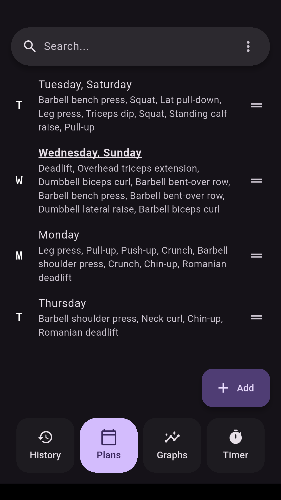
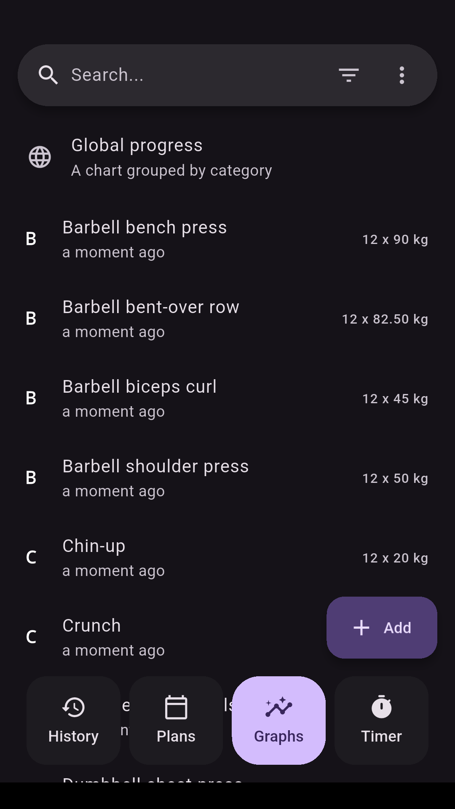
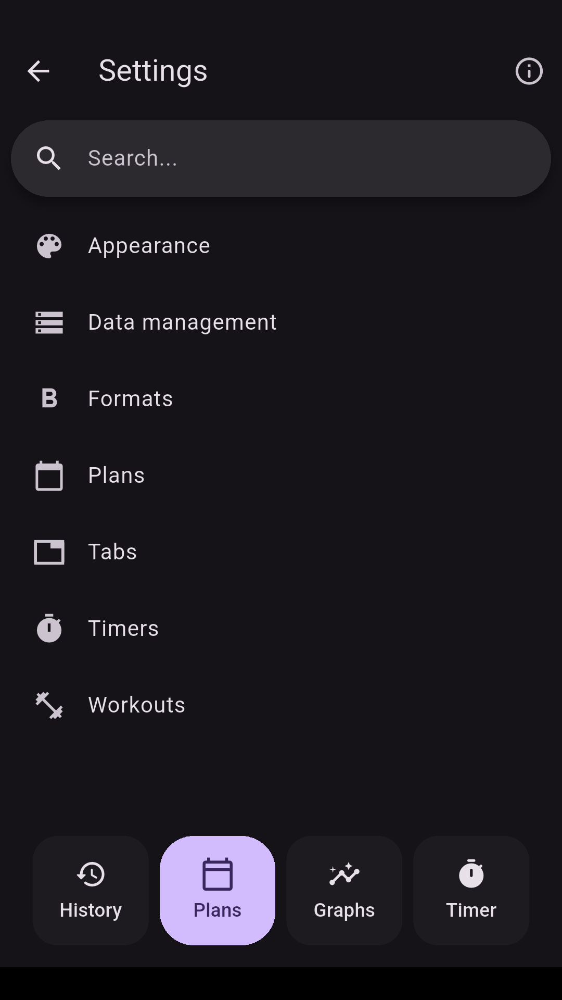
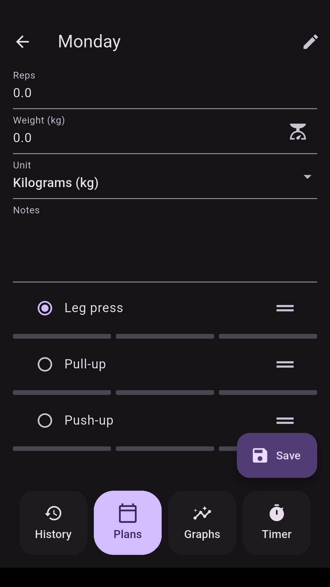
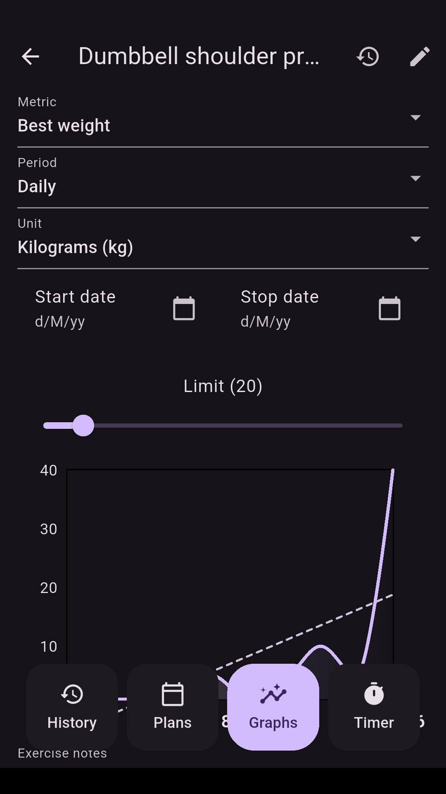
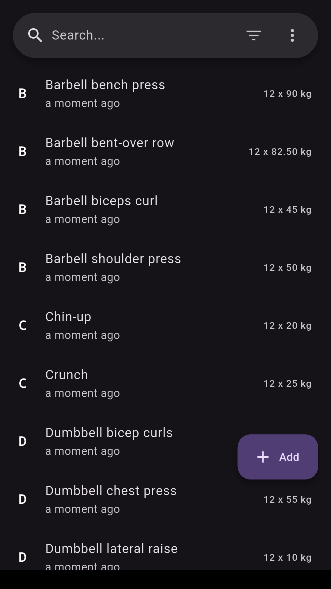
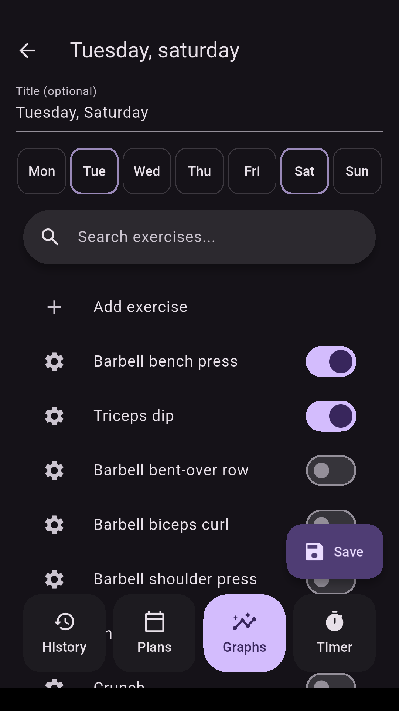
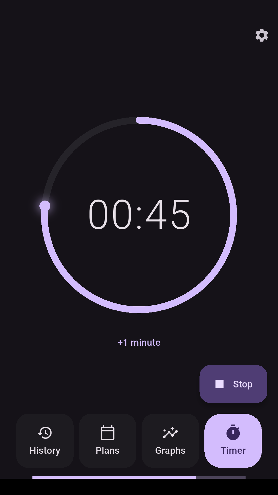

# Flexify

Flex on people with this swanky, lightning-quick gym tracker!


## Features

- 💪 **Strength**: Log your reps and weights with ease.
- 📵 **Offline**: Flexify doesn't use the internet at all.
- 📈 **Graphs**: Visualize your progress over time with intuitive graphs.
- 🏃 **Cardio**: Record your progress with cardio types.
- ⏱️ **Timers**: Stay focused with alarms after resting.
- ⚙️ **Custom**: Toggle features on/off and swap between light/dark theme.


## Screenshots

<p float="left">
    
    
    
    
    
    
    
    
</p>

## Getting Started

To get started with Flexify, follow these steps:

1. **Clone the Repository**: Clone the Flexify repository to your local machine using Git:

   ```bash
   git clone --recursive https://github.com/Nabeel-Farooq/flexify flexify
   ```

2. **Install Dependencies**: Navigate to the project directory and install the necessary dependencies:

   ```bash
   cd flexify
   flutter pub get
   ```

3. **Run the App**: Launch the Flexify app on your preferred device or emulator:

   ```bash
   flutter run
   ```

## ChromeDriver Setup

For automated screenshot testing, you'll need to download ChromeDriver:

### Windows

1. **Download ChromeDriver**: Download the latest ChromeDriver for Windows:
   ```bash
   curl -L -o chromedriver.zip "https://storage.googleapis.com/chrome-for-testing-public/131.0.6778.85/win64/chromedriver-win64.zip"
   ```

2. **Extract**: Extract the downloaded zip file:
   ```bash
   tar -xf chromedriver.zip
   ```

### macOS/Linux

1. **Download ChromeDriver**: Download the appropriate version for your system:
   ```bash
   # For macOS (Intel)
   curl -L -o chromedriver.zip "https://storage.googleapis.com/chrome-for-testing-public/131.0.6778.85/mac-x64/chromedriver-mac-x64.zip"
   
   # For macOS (Apple Silicon)
   curl -L -o chromedriver.zip "https://storage.googleapis.com/chrome-for-testing-public/131.0.6778.85/mac-arm64/chromedriver-mac-arm64.zip"
   
   # For Linux
   curl -L -o chromedriver.zip "https://storage.googleapis.com/chrome-for-testing-public/131.0.6778.85/linux64/chromedriver-linux64.zip"
   ```

2. **Extract**: Extract the downloaded zip file:
   ```bash
   unzip chromedriver.zip
   ```

**Note**: ChromeDriver files are excluded from git due to their size. You'll need to download them locally for screenshot testing to work.

## Migrations

If you edit any of the models in the `lib/database` directory you probably need to create migrations. E.g. assume the version starts at `1`.

1. Bump the `schemaVersion`
   `lib/database/database.dart`

```dart
  int get schemaVersion => 2;
```

2. Run database migrations

```sh
./scripts/migrate.sh
```

3. Add the migration step
   `lib/database/database.dart`

```dart
from1To2: (Migrator m, Schema2 schema) async {
  await m.addColumn(schema.myTable, schema.myTable.myColumn);
},
```

## License

Flexify is licensed under the [MIT License](LICENSE.md).
